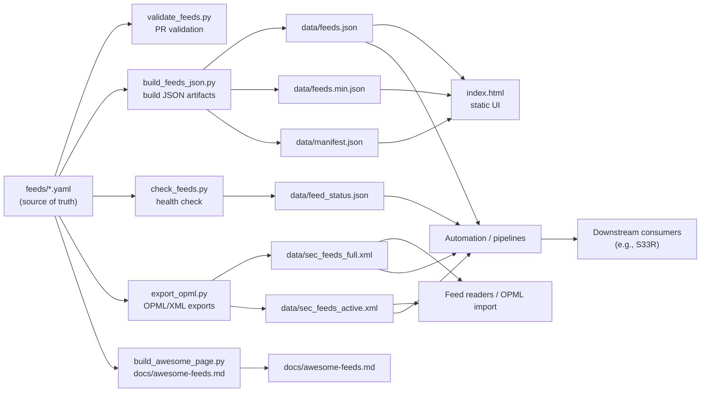

# Architecture

This repository is a **curated source-of-truth** for security RSS/Atom feeds, designed to be:
- easy to review in PRs (human-friendly YAML),
- deterministic for automation (generated JSON + OPML/XML),
- continuously validated (CI).

**Generated:** `2025-12-29T11:59:10.587839+00:00` (UTC)

---

## Core idea

- **Source of truth:** `feeds/*.yaml`
- **Generated artifacts:** `data/` (JSON + OPML/XML + health status)
- **Consumption:** feed readers (OPML), scripts/automation (JSON), and downstream projects (e.g., S33R)

---

## Data flow

---

## What lives where

### `feeds/`
Human-maintained YAML files, grouped by category. Each entry typically includes:
- `title`
- `url`
- `type` (`rss` / `atom`)
- `description`
- `category`

### `scripts/`
Small Python utilities that:
- validate feeds,
- generate JSON used by the UI,
- check feed health,
- export/import OPML,
- (optional) generate documentation pages.

### `data/`
Generated artifacts committed for convenience. These are the “consumption layer”.

### `.github/workflows/`
CI jobs that run validation on PRs and regenerate artifacts on changes to YAML.

---

## CI → artifacts → consumption (high level)

1. **PR changes** to `feeds/*.yaml`  
   → `Validate feeds` runs and blocks invalid changes.

2. **Merge to main**  
   → generation workflows rebuild JSON, OPML/XML, health status  
   → (optional) docs “Awesome” table page is regenerated.

3. **Consumers** (humans + automation) pull artifacts from `data/` or browse via `index.html`.

---

## Relationship to S33R

This repo is **independent**.  
S33R (and other tools) can consume the artifacts produced here (especially `data/feeds.json` / OPML exports), but no S33R code is required to use this repository.
